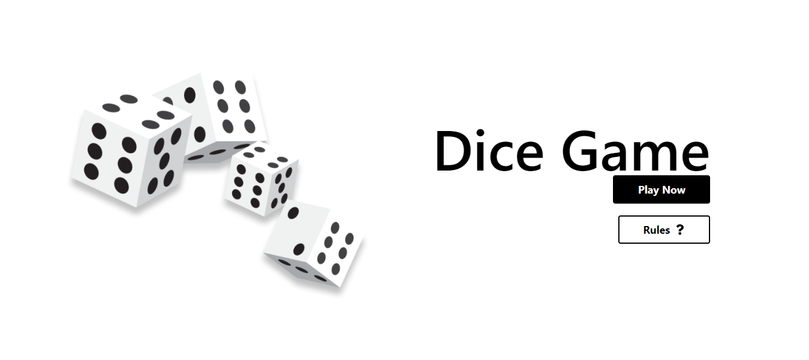
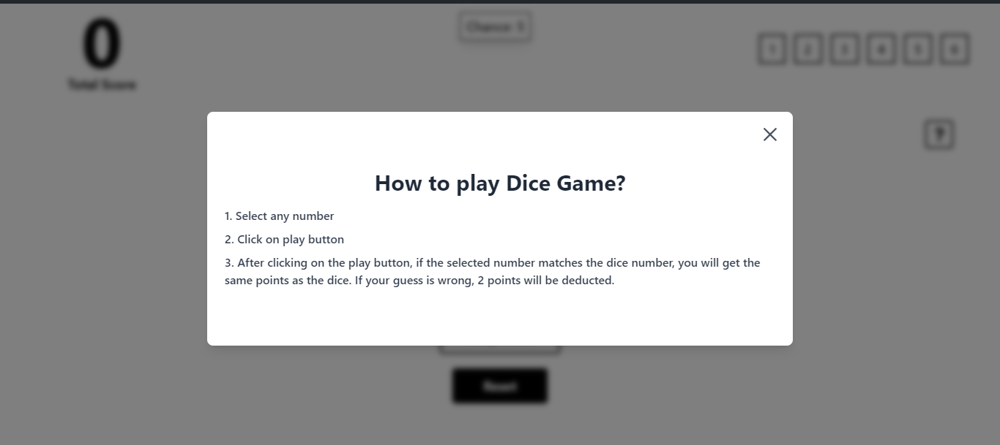
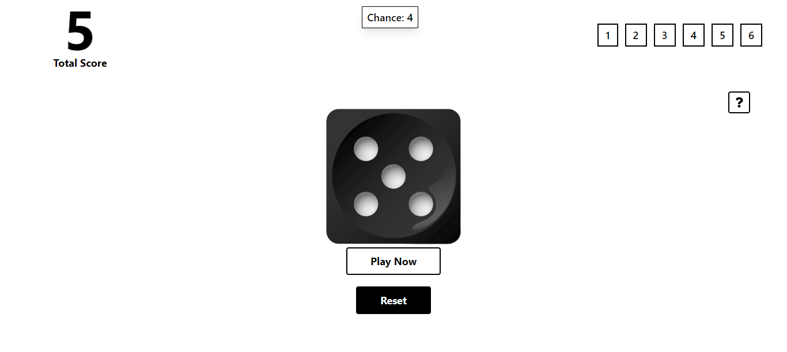

# Dice Game

A simple dice game where players can select a number, roll the dice, and win points based on their guesses.

## Features

- Select a number between 1 and 6.
- Roll the dice by clicking the play button.
- Win points if the selected number matches the dice roll.
- Lose points if the selected number does not match the dice roll.
- See the total score and reset the game.

## Screenshots





## Installation

1. Clone the repository:

    ```bash
    git clone https://github.com/yourusername/dice-game.git
    ```

2. Navigate to the project directory:

    ```bash
    cd dice-game
    ```

3. Install the dependencies:

    ```bash
    npm install
    ```

4. Start the development server:

    ```bash
    npm start
    ```

## Usage

1. Select a number by clicking on it.
2. Click the "Play" button to roll the dice.
3. If the selected number matches the dice number, you gain points equal to the dice number.
4. If the selected number does not match the dice number, 2 points will be deducted.
5. View your total score.
6. Click the "Reset" button to start a new game.

## Components

### `GamePlay.js`

The main component that renders the game board and manages the state of the game.

### `GameOver.js`

Displays the game over screen with the total score and a reset button.

### `Rules.js`

Displays the game rules in a modal window.

